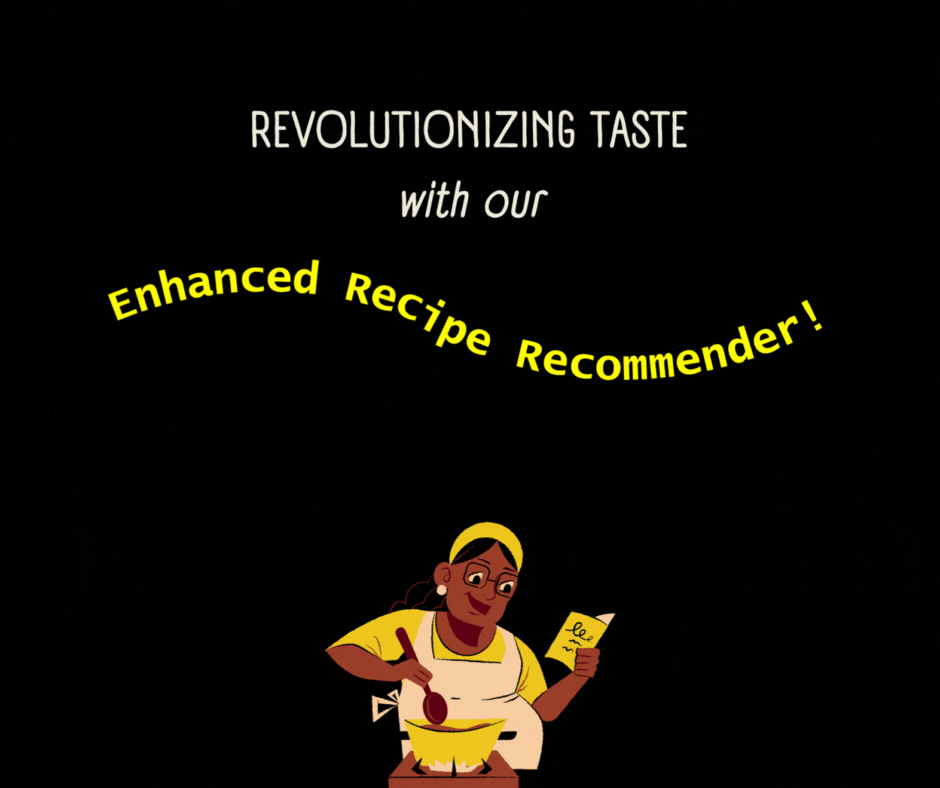

# CookSmart: Search by name or ingredients for any recipe.


<br><br>
## Watch how our application works: 
### Click here to watch - [Youtube Video](https://youtu.be/Xike19n5li0) <br>
<br><br>


[](https://www.javascript.com/)
[](https://doi.org/10.5281/zenodo.14027150)


  
   
<h2> What is CookSmart? </h2>

Say goodbye to the dilemma of deciding what to cook with the ingredients on hand. We’ve revolutionized the cooking experience with an application that effortlessly suggests delicious recipes based on your kitchen inventory. Unlock the full potential of your pantry and fridge as our innovative software guides you in selecting perfect dishes tailored to your current ingredients. Cooking is now an exciting adventure rather than a daunting task. Immerse yourself in a realm of limitless culinary possibilities with CookSmart!  <br>

## Feature additions: Enhancements, Upgrades and BugFixes:
We've added <b> numerous entertaining new features and fixes to enhance user-friendliness.</b> <br>
AI-Powered Recipe Suggestions
Recipes are now dynamically fetched using AI via Google’s Gemini APIs, providing unique, high-quality recommendations instead of relying on static database entries. This allows for more accurate, creative suggestions tailored to your preferences and ingredients.

Firebase Authentication
User login and profile management are now handled by Firebase Authentication, enhancing security and simplifying the login experience. Say goodbye to database-managed credentials and hello to a smoother, safer login process.

Enhanced Recipe Filtering
Enjoy better filtering options to quickly find recipes that match your preferences, dietary requirements, or ingredient availability.

<br> <b> More about our new additions in our next section!</b>


## Documentation and Project Flow:
 <br><br>
1. User Registration: Establish a unique username and password; no duplicate usernames allowed, ensuring password confidentiality.
2. User Authentication: Log in using the correct username and password for secure access.
3. Search Recipes by Ingredients: Input your available ingredients to discover relevant recipes based on ingredient names.
4. Search Recipes by Dish Name: Locate recipes by specifying the dish name in the search.
6. Bookmark Favorite Recipes: Save preferred recipes for easy access.
7. View Bookmarked Recipes in User Profile: Access and review all saved recipes conveniently stored under your user profile.
8. Logout: Securely log out to protect your profile information and activities. <br><br>


Source documentation can be found at: [Recipe Recommender Docs](https://github.com/pnprathima/Recipe_Recommender/blob/master/Recipe%20Recommender%20Source%20Documentation.pdf)


## API Documentation
**get_image_by_name** <br>
Scrapes an image of the recipe from bing.com.

**get_recipes_from_ingredients** <br>
Gets recipes based on the provided ingredients from Gemini along with some sense of pagination. Recipes might duplicate over multiple pages as it is not real pagination.

**get_recipes_by_name** <br>
Gets recipes based on the provided name from Gemini along with some sense of pagination. Recipes might duplicate over multiple pages as it is not real pagination.

**get_detailed_recipe** <br>
 Gets detailed recipe based on name and ingredients with a list of detailed ingredients along with quantities, cooking time and detailed process to cook.

<br>Detailed documentation can be found at: [API Docs](https://github.com/SRN-SE-Fall24/CookSmart/blob/master/API_Documentation.pdf)

## Technology Stack


<br>Detailed documentation can be found at: [TechStack Docs](https://github.com/pnprathima/Recipe_Recommender/blob/master/TechStack-Docs)

## Key Software Requirements

- [Node.js v18.17.1](https://nodejs.org/en/download/)
- [NPM v10.1.0](https://nodejs.org/en/download/)

## Project Setup Steps:

### Installation:
Check out our comprehensive YouTube video demonstrating each step for easy guidance. [Project Setup](https://youtu.be/uKh-afpUdh0)
- clone repository using `git clone https://github.com/pnprathima/Recipe_Recommender.git`
- setup for frontend
  open terminal and navigate to the **frontend** folder and execute the following:
  ```
  npm install
  ```
- setup for functions
  open terminal and navigate to the **functions** folder and deploy the functions to your firebase
  ```
  firebase login
  firebase deploy
  ```

  ## Execution Steps

1.  start frontend server using:
    ```
    npm start
    ```
2.  Automatically a browser window is opened which shows frontend.
3.  run `npm test` for running the tests [Dependencies: Jest, Chai, Supertest]


## Release Made in this cycle <br>
1. Major release 3.1 - Major release to search recipes using NLP AI instead of database stored recipes.
2. Major Release 3.2 - Major release to replace login database with firebase auth<br>
[Read our detailed release notes](https://github.com/pnprathima/Recipe_Recommender/releases) <br>
<br>


### IDE and Code Formatter

- [Visual Studio Code](https://code.visualstudio.com/) IDE
- [Prettier Formatter for Visual Studio Code](https://github.com/prettier/prettier-vscode/blob/main/README.md)


## :page_facing_up: License <a name="License"></a>

This project is licensed under the terms of the MIT license. Please check [License](https://github.com/PvPatel-1001/Recipe_Recommender/blob/master/LICENSE) for more details.

## :pencil2: Contributions <a name="Contributions"></a>

Please see our [CONTRIBUTING.md](https://github.com/pnprathima/Recipe_Recommender/blob/master/CONTRIBUTING.md) for instructions on how to contribute to the project by completing some of the issues.

## FUTURE SCOPE

Implement personalized diertary requirements based filtering.

Meal planning- saving data for all meals of the day.

Voice to text integration. 

Chatbot integration- to answer quick queries about the recipe.

## Team Members

Sharmeen Momin <br>
Rutvik Kulkarni <br>
Nishad Tardalkar <br>

## Troubleshooting and Support
Common issues observed and solutions:<br>
1. requirements.txt failing: this issue should no longer be seen, as we have used ~= to ensure your systems pick up versions compatible with the other packages. However, if you happen to see the issue, modify the requirements.txt file to use a more recent version.
2. python was not found: we recommend using python3 as some of the modules are available only on Python3. You may either install Python3 or setup a virtual environment(we suggest the latter if you are currently running other applications on python2)
Facing other issues with the application? Mail us - [teamsoftwareeng7@gmail.com](teamsoftwareeng7@gmail.com)


<p align="center">Made with ❤️ on GitHub.</p>
